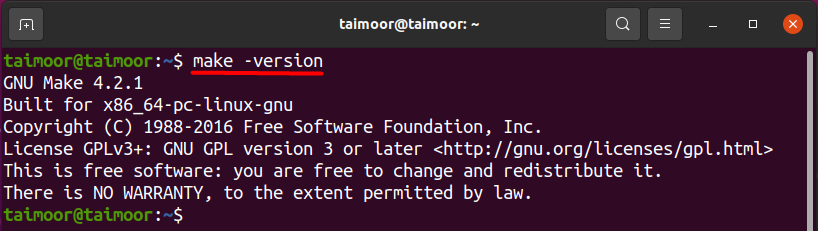

# Backup Script
**Backup Script** is a **shell script**  that constantly backup your work directory every sometime to another directory that the user choose.

## Folder hieratically 
There is **3 main files**
- **backup-cron.sh**
- **backupd.sh**
- **makefile**
- **readme.md** <--- current file
 
**backup-cron.sh**: This file is the main script which contain the code of backup using cron.

**backupd.sh**: This file is the main script which contain the code of backup without cron.

**makefile**: This file is responsible of running the script correctly.

**readme.md**: For Documentation.

## Prerequisites
You had to have make installed to run the script

First update by typing.
```
sudo apt update
```

Then you can check if you had make from this command
```
make -version
```


Install make by typing.
```
sudo apt install make
```

### Cron
If you are going to use cron you have to make sure that cron server is running by using the following command
```
sudo systemctl status cron.service
```


## Step by Step Instructions Without cron

You have to run the makefile using the following command
```
make SOURCE=? BACKUP=? SECS=? MAX=?
```

**SOURCE:** the directory you want to backup **(Default: ~/workspace)**.

**BACKUP:** backup directory **(Default: ~/work_backup)**. 

**SECS:** backup every how much time in sec **(Default: 1min)**.

**MAX:** max number of backups before delete.oldest backups **(Default: 10)**.

This is how to run with default arguments
```
make
```
### Note
So you can run your code with those default values but make sure that you have **~/workspace** directory or you will get an **error!**.

## Step by Step Instructions using cron
If you willing to use cron this section is for you

## Preparation
First you have to run 